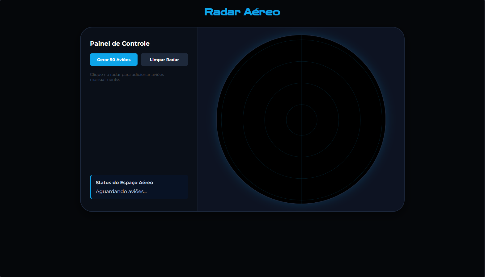
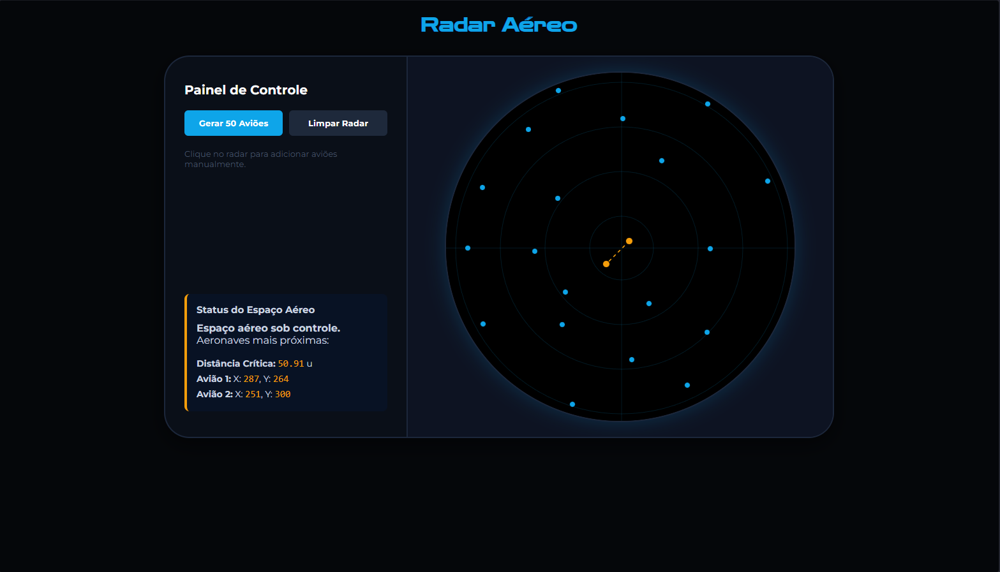
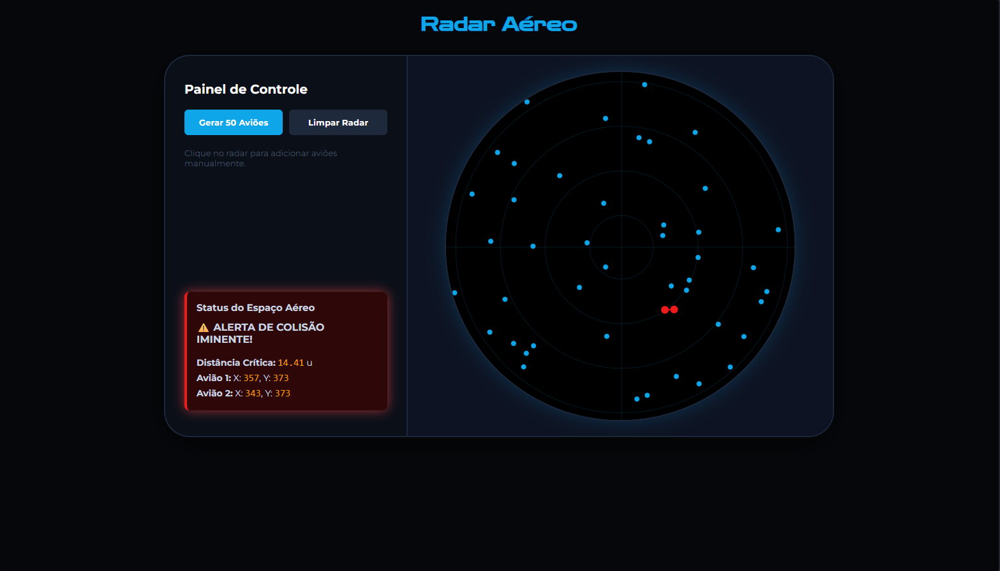

# Radar Aéreo

Número da Lista: 35<br>
Conteúdo da Disciplina: Dividir e Conquistar<br>

## Alunos
|Matrícula | Aluno |
| -- | -- |
| 21/1061860 | Henrique Martins Alencar |

## Vídeo de Apresentação

* 

## Sobre 

Este projeto é um sistema web interativo que simula o monitoramento de um espaço aéreo. O objetivo é aplicar o algortimo **Par de Pontos Mais Próximos** para identificar as duas aeronaves com a menor distância entre si, indicando o risco de colisão.

## Screenshots

### Página Inicial



### Sem risco de colisão



### Com risco de colisão



## Instalação 
Linguagem: Python, HTML, CSS, JavaScript <br>
Framework: Flask <br>

### Pré-requisitos:

* Python 3.x

* Pip.

### Instalação e execução:

* Clone este repositório:

```bash
git clone https://github.com/projeto-de-algoritmos-2026/G35_Dividir-e-Conquistar_PA-26.1
cd G35_Dividir-e-Conquistar_PA-26.1
```

* Instale o Flask:

```bash
pip install flask
```

* Execute o servidor local:

```bash
python app.py
```

## Uso 

* Acesse o endereço: http://127.0.0.1:5000
* Adicione manualmente aeronaves clicando em qualquer lugar do radar;
* Clique no botão "Gerar 50 Aviões" para popular aleatoriamente;
* O painel mostrará os aviões mais próximos e caso haja risco de colisão;
* Clique em "Limpar Radar" para reiniciar a simulação.